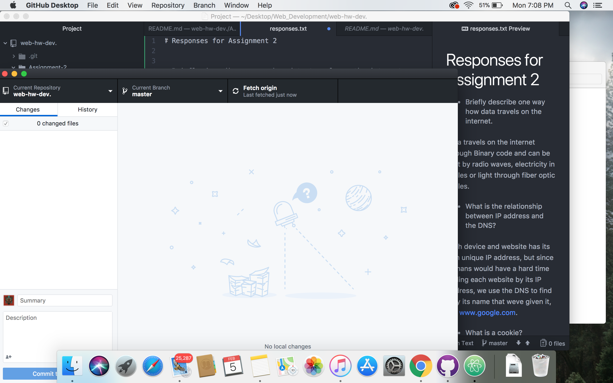

# Assignment 2

A VCS (Version Control System) is an application or software that allows you to be able to see what changes you make to a document or website and gives you the ability to even go back to any point in a project and fix or revise anything you want. We are using GIT which even gives us the ability to collaborate with other people and make revisions simultaneously. We are using GIT because of all these reasons and because it is an industry standard .

[My Responses](./responses.txt)

This week I followed along with the lessons and created all the folders asked for in the lesson. It was a little tough to follow along because the pictures were small but I managed to work my through and learned a lot about folder setup and how to link folders and files. I didnt have any questions and I feel that Im getting less overwhelmed with GITHUB.

