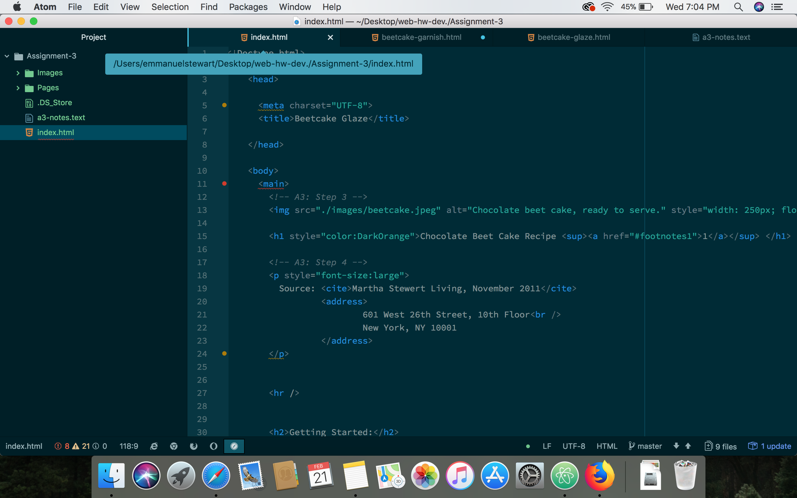

# Readme.md
## Emmanuel stewart
#### Head and Body
Each HTML document can only have one head and one body.
The head is invisible to the visitor but contains metadata for your page.
The body is what will be rendered by the browser.

#### Sturctural and Semantic Markup
Structural Markup embeds information about the structure of the markup.
Semantic Markup is used to reinforce the information of the markup.

#### My work
For this week I followed the lessons and read all the pages, and then followed through line by line of the "how to" for the assignment. I found this assignment very tedious as I had to look up how to do everything! It was just alot of information to take in and I had trouble remembering how to do everything the right way. But I got through and I feel like im getting a better understanding of how all this works.

