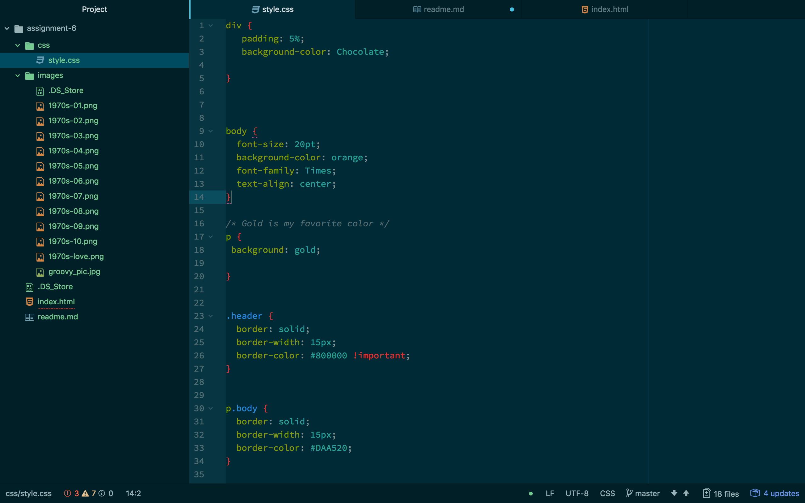

# Assignment 6

This week was fun and challenging. Im still not sure "what is meant by using the what size is my broswer" thing that was mentioned.

My proccess for this week was to just get my hands dirty and figure it out along the way until I satisfied all the requirments and then style it to make it look as good as I could.I didnt really have an idea for what I wanted so I thought Id just dive and see what happens. Three of the many colors I chose were Goldenrod,Chocolate and Orange. These colors exemplify the 70s and I knew they would be perfect.

I find my really starting to understand how classes and divs work and to me thats really exciting because they almost made no sense to me before.

