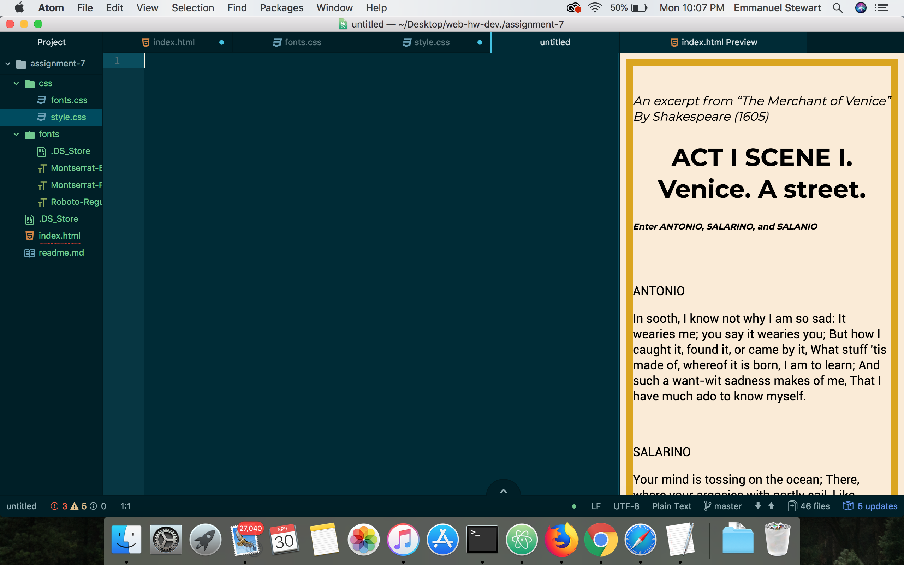

# Assignment 7

This week I chose the Shakespeare text because I used to do theatre, and I though it would be fun. I wanted my page to have a nice clean modern look, so I went with Montserrat and I knew that Roboto is a good complementary font.

* A system font is a font utilized by the operating system for displaying text used in menus, icons, errors, etc

* Web fonts are custom fonts hosted on a server. They do not have to be available on the user's device to appear, but require certain elements to get called up correctly.

* Fonts that developers can count on being available by the system are known as "web-safe" fonts.

Fallback fonts are important so that the web page cant display your font, it will have a fallback font that can  fit the designers scheme.

This week my work flow was following along with the lessons and then I started my howework.

